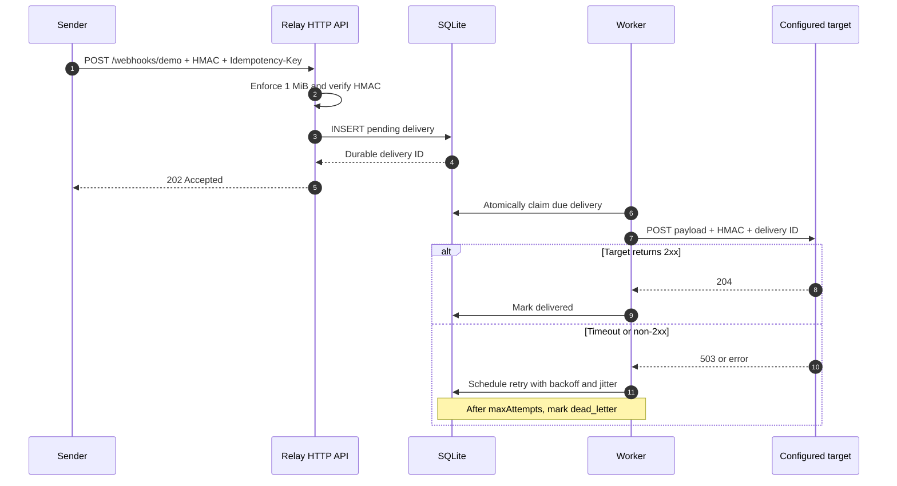

# Reliable Webhook Relay

[](https://github.com/German4341374/reliable-webhook-relay/actions/workflows/ci.yml)
[](https://go.dev/)
[](LICENSE)

Receive a signed webhook and forward it to another HTTP endpoint.
The relay saves the event in SQLite before sending it, so pending work can survive a restart.
If delivery fails, it retries up to the configured limit.

You can inspect deliveries and retry them through the API. No separate message broker is
needed, and receivers should still expect that a delivery may arrive more than once.

## Features

- HMAC SHA-256 verification using `X-Webhook-Signature`
- Durable SQLite delivery records and embedded migrations
- Per-channel timeout and maximum attempt policy
- Exponential backoff with jitter and a dead-letter state
- Idempotent intake scoped by channel and `Idempotency-Key`
- 1 MiB payload limit and bounded HTTP server timeouts
- SSRF protection at configuration load and every outbound connection
- Structured JSON logs with sensitive header redaction
- Prometheus-compatible counters and dependency-aware health checks
- Graceful HTTP shutdown and recovery of interrupted deliveries
- Non-root, multi-stage distroless container image
- A demo receiver that can intentionally fail the first request

## Flow



The delivery is stored before the API acknowledges it. Delivery is
**at least once**, so targets must tolerate duplicates: use
`X-Relay-Delivery-ID` or the forwarded `Idempotency-Key` for deduplication.

## Technology

- Go 1.26.6 and the standard `net/http`, `log/slog`, and crypto packages
- SQLite through the pure-Go `modernc.org/sqlite` driver
- Docker Compose for the relay, fake receiver, network, and named volume
- GitHub Actions for format, vet, race tests, builds, and Trivy image scanning

## Repository layout

```text
cmd/
  relay/            Main service
  demo-receiver/    Local failure/success target
  healthcheck/      Static container health probe
config/             Secret-free JSON example
internal/
  api/              HTTP handlers and JSON responses
  config/           Strict configuration and environment resolution
  metrics/          Atomic process counters
  security/         HMAC, header redaction, and SSRF controls
  storage/          SQLite migrations and delivery state transitions
  worker/           Background dispatch and retry policy
migrations/         Embedded SQL migrations
docs/               Operations guide and threat model
```

## Quick start with Docker

Prerequisites are Docker Engine 27+ with Compose v2, `curl`, and `openssl`.
Docker Desktop with WSL2 or a Linux Docker installation both work.

```bash
cp .env.example .env
docker compose up --build -d
docker compose ps
./scripts/send-demo.sh
```

The demo receiver intentionally returns `503` once. Within a few seconds the
relay retries and records a successful `204` response:

```bash
curl --fail http://localhost:8080/deliveries
curl --fail http://localhost:8080/metrics
docker compose logs relay receiver
```

Stop the stack with `docker compose down`. Use `make clean` only when you also
want to delete the named volume and all local delivery data.

## Run with Go

Install Go 1.26.6, then start any local target you control. Loopback targets
are blocked by default, so the development override is required for a local
receiver:

```bash
go mod download
export RELAY_CHANNEL_DEMO_SECRET='local-only-secret-at-least-16-chars'
export RELAY_ALLOW_PRIVATE_TARGETS=true
go run ./cmd/demo-receiver
```

In another terminal:

```bash
export RELAY_CHANNEL_DEMO_SECRET='local-only-secret-at-least-16-chars'
export RELAY_ALLOW_PRIVATE_TARGETS=true
go run ./cmd/relay -config config/config.local.example.json
```

Do not enable `RELAY_ALLOW_PRIVATE_TARGETS` for an internet-facing deployment.
For a public HTTPS target, leave it unset.

## Configuration

Configuration is strict JSON. Unknown fields, duplicate channel names,
malformed durations, short secrets, and invalid attempt limits stop startup.
Secrets are referenced by environment variable and never stored in the file.

```json
{
  "listenAddress": ":8080",
  "databasePath": "/data/relay.db",
  "pollInterval": "500ms",
  "baseBackoff": "1s",
  "maxBackoff": "1m",
  "shutdownTimeout": "10s",
  "channels": [
    {
      "name": "demo",
      "targetURL": "http://receiver:9090/webhooks",
      "secretEnv": "RELAY_CHANNEL_DEMO_SECRET",
      "timeout": "3s",
      "maxAttempts": 5
    }
  ]
}
```

Durations use Go syntax such as `500ms`, `3s`, and `1m`. Channel names can
contain letters, numbers, `_`, and `-`. A channel secret must contain at least
16 characters.

## Signing and sending a webhook

The canonical signature is the lowercase hexadecimal HMAC of the exact body,
prefixed by `sha256=`:

```bash
export SECRET='replace-with-at-least-16-random-characters'
PAYLOAD='{"event":"ticket.created","ticketId":42}'
SIGNATURE="sha256=$(printf '%s' "$PAYLOAD" | \
  openssl dgst -sha256 -hmac "$SECRET" -hex | awk '{print $2}')"

curl --fail-with-body --request POST \
  --header 'Content-Type: application/json' \
  --header 'Idempotency-Key: ticket-created-42' \
  --header "X-Webhook-Signature: $SIGNATURE" \
  --data "$PAYLOAD" \
  http://localhost:8080/webhooks/demo
```

Repeating that exact request returns `200 OK`, `duplicate: true`, and the
original delivery ID. The first accepted request returns `202 Accepted`.

## API

| Method | Path | Purpose |
| --- | --- | --- |
| `POST` | `/webhooks/{channel}` | Validate, deduplicate, and persist an event |
| `GET` | `/deliveries` | List recent records; supports `limit`, `status`, and `channel` |
| `GET` | `/deliveries/{id}` | Read delivery metadata without the payload |
| `POST` | `/deliveries/{id}/retry` | Reset a dead-letter delivery |
| `GET` | `/health` | Check SQLite and worker health |
| `GET` | `/metrics` | Return process counters in Prometheus text format |

Example inspection:

```bash
curl --fail 'http://localhost:8080/deliveries?status=retrying&limit=20'
curl --fail http://localhost:8080/deliveries/DELIVERY_ID
curl --fail-with-body -X POST \
  http://localhost:8080/deliveries/DEAD_LETTER_ID/retry
```

Errors use one JSON shape:

```json
{
  "error": {
    "code": "invalid_signature",
    "message": "webhook signature is missing or invalid"
  }
}
```

`GET /metrics` exports:

- `received_total`: newly persisted deliveries
- `delivered_total`: successful deliveries
- `failed_total`: failed delivery attempts
- `retry_total`: retries scheduled

Counters reset on process restart; delivery records do not.

## Retry policy

Attempt `n` starts with `baseBackoff × 2^(n-1)` and adds up to 25% positive
jitter. The result never exceeds `maxBackoff`. A network failure, timeout, or
any non-2xx response is retryable. Once `maxAttempts` is reached, the record
enters `dead_letter`. An operator can correct the problem and invoke the retry
endpoint for a fresh attempt cycle.

See [Operations Guide](docs/operations.md) for recovery and backup procedures.

## Security model

- Incoming signatures use constant-time comparison.
- Payload and headers are bounded; server and target calls have timeouts.
- Only `http` and `https` targets without embedded credentials are accepted.
- Loopback, private, link-local, unspecified, and multicast targets are blocked.
- DNS is resolved again for each connection to reduce DNS-rebinding risk.
- Authorization, cookies, tokens, signatures, secrets, API keys, and
  idempotency headers are redacted from request logs.
- Redirects are not followed; operators must configure the final target URL.
- The image runs as UID/GID `65532`, drops Linux capabilities in Compose, and
  uses a read-only root filesystem.
- Payload bodies are never returned from delivery APIs or written to logs.

The delivery inspection and retry endpoints intentionally have no application
authentication. Put the service behind TLS, authentication, rate limiting, and
network access controls. See the detailed [Threat Model](docs/threat-model.md)
and [Security Policy](SECURITY.md).

## Development

```bash
make setup
make lint
make test
make build
```

Equivalent commands:

```bash
gofmt -w .
go vet ./...
go test -race -coverprofile=coverage.out ./...
go build ./cmd/relay ./cmd/demo-receiver ./cmd/healthcheck
```

On Windows PowerShell, after `make build` or the equivalent three `go build`
commands with `.exe` outputs, run `powershell -File scripts/smoke.ps1` for a
process-level health, signing, failure, retry, and delivery check.

Tests cover signature verification, header masking, SSRF validation,
idempotency, backoff calculation, payload limits, and a full persisted
503-to-retry-to-204 relay flow.

## Troubleshooting

**Startup says the target resolves to a forbidden address.** This is the
expected production-safe default. Use a public target or, only for a controlled
local demonstration, set `RELAY_ALLOW_PRIVATE_TARGETS=true`.

**A valid signature is rejected.** Sign the exact bytes sent over the wire.
Trailing newlines and JSON whitespace change the HMAC.

**A delivery remains in `retrying`.** Inspect `lastError`, confirm the target
is reachable and returns 2xx, then wait until `nextAttemptAt`.

**The container cannot create `/data/relay.db`.** Recreate the development
volume from the image with `make clean && make up`. For production, ensure the
mounted directory is writable by UID/GID `65532`.

**`/health` returns 503.** Check both database access and worker state in the
response, then inspect structured logs.

## Limitations

- SQLite and the in-process worker intentionally support one relay instance.
- At-least-once delivery can produce duplicates.
- Metrics are process-local and are not persisted.
- Configuration reload requires a restart.
- Payloads are stored unencrypted at rest.
- Authentication, TLS termination, per-client rate limiting, and retention
  cleanup are deployment responsibilities.

## Possible next steps

- Separate inbound and outbound channel secrets
- Add configurable payload retention and secure deletion
- Add OpenTelemetry traces and durable metric collection
- Support online secret rotation with dual-key verification
- Add PostgreSQL leasing for safe multi-instance workers
- Provide an authenticated operator API

## License

[MIT](LICENSE)
